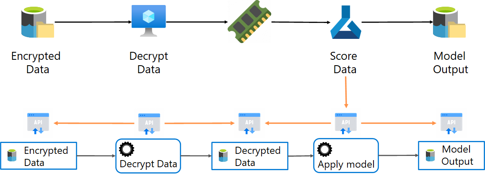
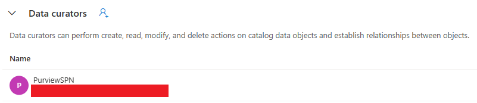

## Using PyApacheAtlas to create lineage in Purview

This code is used to create assets and lineage in Purview with the PyApacheAtlas libraries. This code uses a service principal with Data Curator permissions in Purview

1. Create Service Principal and store the details and secret in the key vault
2. Connect to Purview.
3. Get the lists of collections.
4. Create data assets and lineage in a specific collection.

See the image below for the lineage flow:



### 1. Create Service Principal and store the details and secret in the key vault
First create a service principal. Store the details of that service principal and the secret in the key vault with the following names:
- spn-tenant-id
- spn-client-id
- spn-client-secret

Assign the data curator permission in Purview to the service principal. The data curator role allows the code to make modifications to the data objects and lineage through the service principal:



### 2. Connect to Purvew
```def connect_to_purview(keyVaultName, purviewName):```<br>
This function connects to Purview and is required for creating entity types. It uses the service principal credentials from the key vault with OAuth.

```def connect_to_purviewCollection(keyVaultName, purviewName):```<br>
This function connects to Purview and to a specific collection. It is used to create assets and lineage in a specific collection. It uses the service principal credentials from the key vault with OAuth.

### 3. Get the list of collection
The goal is to create assets in a specific collection. Since the technical name of a collection is not available through the UI, the following code is used to print all collection names with their friendly name.

&nbsp;&nbsp;&nbsp;```collections = purColClient.list_collections()```<br>
&nbsp;&nbsp;&nbsp;```for value in collections:```<br>
&nbsp;&nbsp;&nbsp;&nbsp;&nbsp;&nbsp;&nbsp;&nbsp;```print(value)```<br>

### 4. Create data assets and lineage in a specific collection
1. Use collection name from the previous step
2. Connect to Purview
3. Create entity type definition 'in-memory'
4. Create data assets (entities)
    - Source
    - In-memory
    - Target
5. Create lineage
    - Lineage from Source to In-memory
    - Lineage from In-memory to Target

### Interesting links
- PyApacheAtlas readme: https://github.com/wjohnson/pyapacheatlas/blob/master/samples/excel/README.md
- PyApacheAtlas documentation: https://wjohnson.github.io/pyapacheatlas-docs/latest/core/api/pyapacheatlas.core.discovery.purview.PurviewDiscoveryClient.browse.html#pyapacheatlas.core.discovery.purview.PurviewDiscoveryClient.browse
- Tutorial: Atlas 2.2 API: https://learn.microsoft.com/en-us/azure/purview/tutorial-atlas-2-2-apis

